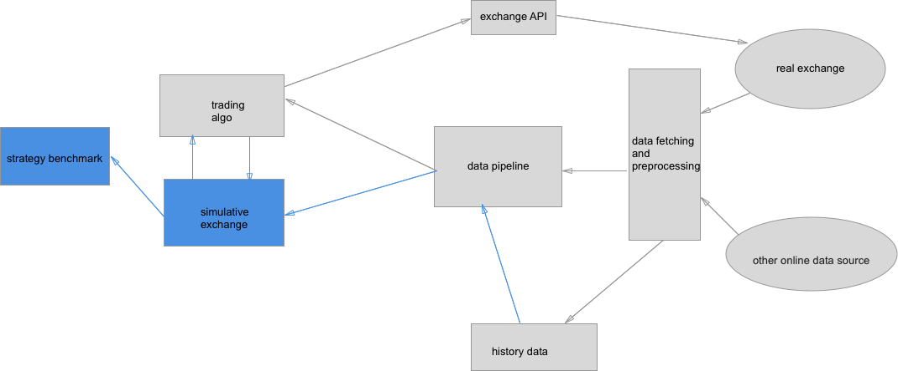

# Fermi: A Lightweight Modular Platform for Sleepless Quantitative Trading

Fermi is a platform for quantitative trading on 24/7 markets, with modules for data mining, strategy backtesting, paper-trading, and live-trading. Fermi is particularly suitable for trading on cryptocurrency markets. 

## Overview

Fermi is composed of following parts:

- Data fetching and preprocessing

- Data pipeline

- Trading algo

- Simulative exchange

- Exchange API

- Strategy benchmark

The relation of these parts is as follows:

{ width=80% }

### Data fetching and preprocessing

Data fetching is responsible of fetching data from web sources, including (but not limited to) market data from exchanges and fundamental data from social networks. All fetched data are then preprocessed so that they can be distributed through data pipeline. These data are sent to the data pipeline (for paper trading or live-trading) and also saved to local harddisk as historical data for later use. 

Data fetching is usually driven by time. The request for data is sent out repeatedly after a fixed time interval. All the data processed in Fermi are timestamped. The remaining parts of Fermi are driven by the events in the timestamped data.

### Data pipeline

Data pipeline reads data directly from prepreocessed data (for paper trading or live-trading) or from local historical data (for backtesting). All the daya are distributed to backend modules in time order effectively through a heap. The rationale behind is that it is easy to detect look-ahead bias in backtesting this way.

### Trading algo

Trading algo gets a dictionary from data pipeline, then performs the the algorithm based on the data to determine how to trade. Trading algo sends orders, e.g., market buy or limit sell, through an unified API which is the same for backtesting or live-trading. 

In the live-trading mode, the orders are sent to the exchange API, which are further sent to the exchange. In the paper-trading and backtesting mode, the orders are sent to a simulative exchange. 

### Simulative exchange

Simulative exchange simulates a real exchange. It takes order from the trading algo, then determines whether the order can be filled based on the historical data. If the order can be filled, it records the change of the position. If the order cannot be filled or partially filled, the order will remain until fully-filled or cancelled. 

The simulative change should be able to incorporate trading fees and slippage model for more accurate backtesting results. 

### Strategy benchmark

Strategy benchmark provides basic tools for benchmarking and visualizing a strategy. 

## Simulative exchange

In order to simulate a real exchange, the most basic data it needs is the timestamped price for a universe of symbols (trading pairs). If given only timestamped price, all buy/sell orders placed at time `t` will be filled at the price at the timestamp next to `t`, and the market impact is completely neglected. In the following, we always assume the data is by minute, i.e., the nearest two timestamps differ by 1 minute. 

### Slippage model
1. Fixed basepoint slippage. All buy/sell orders are filled `0.01x%` higher/lower than the next timestamped price. `x` is the base point usually taken as `5` or `10`. This mimics the commission fee taken by the exchange. 
  Example:

2. Spread slippage. If the bid/ask price is also provided to the exchange, all buy/sell orders are filled higher/lower with `n%` spread than the next timestamped price. `n` is usually taken as `50`.
  Example: 

3. Volume slippage. If volume (usually 24h) is also provided to the exchange, the tradable volume is distributed uniformally through every minute. Each minute, `m%` of the tradable volume will be filled. The remaining order will be placed at next minute following the same tradable volume. `m` is usually taken as `2.5`.
  Example: 

4. Custom slippage. To be supported. 

TO DO: A comparison of the slippage model with the real slippage.